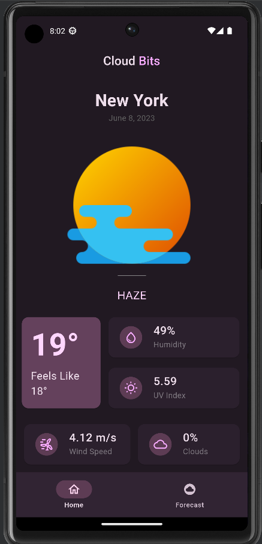

# Cloud Bits - Another Weather App. Based on Material You

Cloud Bits is a modern weather app built with Material You design principles. It provides accurate weather information using the [OpenWeather API](https://openweathermap.org/), ensuring up-to-date forecasts. The app leverages the power of [GetX](https://github.com/jonataslaw/getx) for efficient state management, enabling a smooth user experience.

## Screenshots

### Home Page
   

### Forecast
   

## Getting Started

This project is a starting point for a Flutter application.

A few resources to get you started if this is your first Flutter project:

- [Lab: Write your first Flutter app](https://docs.flutter.dev/get-started/codelab)
- [Cookbook: Useful Flutter samples](https://docs.flutter.dev/cookbook)

For help getting started with Flutter development, view the
[online documentation](https://docs.flutter.dev/), which offers tutorials,
samples, guidance on mobile development, and a full API reference.
"# Cloud-Bits" 
